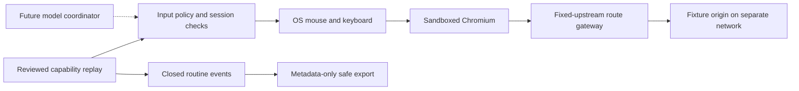

# Milestone 2: Policy enforcement and safe evidence

Status: **M2-01 through M2-04 complete for the declared environment**, 2026-09-15. This is the bounded PoC B from the roadmap. [Acceptance evidence](../evidence/poc-m2/README.md) retains the failed and passing full attempts and final two-file hardening verification: 63 engine tests, 14 fixture tests, ten baselines, seven scenarios, seven rejection cases, live policy checks, and safe export. No model calls or human takeover were added. M2 was committed and pushed as `3726347` at the user’s request.

## Outcome and scope

Keep the existing savings lookup working while rejecting unapproved actions, applications, destinations, routes, and artifact revisions. Produce a shareable evidence export without member values, raw screen pixels, raw exceptions, or arbitrary strings from an artifact. The policy is operator-owned code/configuration; page text, future model actions, and capability files cannot grant themselves permission.

The supported environment remains the synthetic Linux ARM64/X11 desktop, 1280×800, one bootstrapped application, fixed rendering, and a read-only banking operation. Root access, a malicious fixture or compromised X11 client, hostile Python code, and general screenshot-based authorization are outside this gate. The future model receives structured tools, never a shell or policy-editing tool. Local operators retain control of their development environment.

Business outputs stay in explicit local result files. Captured pixels remain in memory during ordinary replay. A safe evidence export is not an authorization to send raw observations to a provider: PoC E must separately review its outbound screenshot handling before enabling model calls.

## Research and decisions

Research checked 2026-09-15; source claims below are distinguished from our design choices.

| Question | Options and tradeoffs | Selected approach |
| --- | --- | --- |
| Destination and route restrictions | Internal Docker networking prevents ordinary external egress but does not authorize routes. Chromium managed policies are lightweight and block navigation, but path filters use prefixes and are browser-specific. A reverse proxy can enforce exact paths/methods and reject redirects, at the cost of another service and network. | Internal networks plus a narrow fixed-upstream gateway. Keep the fixture origin off the desktop network. Chromium policies add navigation restrictions; the gateway is the HTTP route/method boundary. |
| Operation authorization | A model's declared intent or an action type such as `click` cannot authorize the underlying operation. A reviewed artifact hash provides a small auditable admission boundary but each new artifact needs promotion. Visual rules can restrict input regions but cannot prove safety against a malicious page. | Admit the reviewed M1 artifact by digest; add a bank input policy with fresh visual targets and a limited keyboard context. Unknown controls and shortcuts are denied. Discovery must later use this same checked input boundary. |
| Application identity | Window titles are easy to change. Window ID, class and OS process identity give a stronger binding, but X11 remains a shared trust domain. | Bind to the bootstrapped window and its application process; recheck at dispatch. Keep the existing session, focus, stop and deadline checks. |
| Screenshot evidence | OCR redaction preserves context but can miss secrets. Masking known rectangles assumes layout. Suppressing images loses diagnostic detail but cannot disclose their pixels. | Default export excludes all screenshots and explicit business results. Routine events use a closed vocabulary. Rich screenshot export is deferred until independently reviewed public-region rules exist; do not label an unredacted image safe. |
| Trusting capability metadata | Schema validation proves structure, not authorization or data sensitivity. Accepting arbitrary identifiers/descriptions into logs permits data leakage. | Admission happens before capability metadata enters reports or the desktop is acquired. Export reconstructs a bounded summary from validated values and never copies arbitrary files. |

Primary sources:

- [Docker Compose networking](https://docs.docker.com/reference/compose-file/networks/): services must share an assigned network to communicate normally; `internal` creates externally isolated networks. Our gateway placement is a design choice, not a claim of protection from arbitrary host/root access.
- [Chromium Linux policy setup](https://www.chromium.org/administrators/linux-quick-start/): mandatory policy files live under the distribution's managed policy directory and should be writable only by administrators.
- [Chrome URL filter semantics](https://support.google.com/chrome/a/answer/9942583?hl=en) and [URLAllowlist](https://chromeenterprise.google/policies/url-allowlist/): paths are matched as prefixes and specific exceptions can override a blanket block. Allowing `/` is not an exact-root route restriction.
- [OWASP authorization guidance](https://cheatsheetseries.owasp.org/cheatsheets/Authorization_Cheat_Sheet.html): deny by default and validate authorization at each request boundary. Here that maps to artifact admission, OS input dispatch, and gateway requests.
- [OWASP logging guidance](https://cheatsheetseries.owasp.org/cheatsheets/Logging_Cheat_Sheet.html): exclude sensitive values and validate data crossing trust zones. Here we select fields and closed values before persistence/export instead of relying on substring replacement afterward.

## Work packages and dependencies

| ID | Deliverable | Depends on | Acceptance |
| --- | --- | --- | --- |
| M2-01 (done) | Reviewed policy, artifact admission, operation checks | M1 | Unapproved artifact/control/shortcut fails before input; permitted lookup still works |
| M2-02 (done) | Network separation, fixed-route gateway, browser restrictions | Policy definition | Allowed app loads; forbidden origin/path/method/query/redirect cannot reach an unapproved upstream |
| M2-03 (done) | Closed event vocabulary and safe export | Policy definition | Sensitive markers in log fields, metadata, results, images and extra files are rejected or excluded; no raw copy-through |
| M2-04 (done) | Live adversarial checks, replay regression, retained evidence | M2-01–03 | Application/focus rejection, prohibited operation, gateway denials, export audit, and normal replay all pass |

The gateway and evidence work do not require an OpenAI key. Human takeover is the next independent milestone. Genuine discovery remains blocked on this gate and API access. Any new discovery-generated artifact needs an explicit, recorded promotion into the operator-owned policy.

## Required checks and limits

1. Successful default and translated replay for both members, plus existing missing/delayed/duplicate/unreadable/blocked cases.
2. A schema-valid but unapproved artifact is rejected before desktop acquisition and before untrusted metadata is logged.
3. Off-target clicks, address-bar/OS shortcuts, arbitrary typing and stale keyboard contexts cannot emit OS input.
4. Unexpected application focus causes a structured rejection; no automatic refocus-and-retry.
5. The desktop cannot directly address the fixture origin. Gateway rejection tests cover method, exact path, encoded traversal, query strings, duplicate/foreign Host headers, request bodies, absolute URLs and redirects.
6. Browser restrictions are verified in the installed Chromium, rather than inferred from the presence of a JSON file.
7. Evidence tests inject sensitive markers into both expected and unexpected fields. Export includes neither results nor images nor extra source files, and rejects invalid/symlinked input.
8. Preserve failed attempts. Stop on uncertain actions; never retry input to make a test pass. Distinguish synthetic calibration utilities from the ordinary execution/evidence path.

No PoC success implies arbitrary applications, untrusted web pages, robust secret detection, general browser isolation, or a completed human ownership protocol. The viewer remains a local view of synthetic data. Screenshots may exist in legacy calibration bundles; safe export must never copy them.

## Implementation findings

- The first ordinary replay through the split networks and new input policy succeeded for member B. No artifact or anchor change was needed.
- A headless Chromium `--dump-dom` probe timed out after 15 seconds before establishing policy enforcement. Its exact cause is unproven; this is not evidence that navigation policy failed. [Chrome documents headless command-line inspection](https://developer.chrome.com/docs/automation-and-testing/headless-cli), but compatibility in our locked-down build still needed measurement. Options were to investigate headless internals, weaken browser restrictions for the probe, or test the deployed visible browser. We selected the visible browser because it exercises the actual desktop configuration without changing its restrictions.
- The first visible-screen assertion expected the word `administrator`. This Chromium displays an organization-block message instead. A follow-up check established `blocked`, `organization`, and `allow` on the visible screen; the acceptance harness now checks that observed wording. OCR and input thresholds were not changed. Each navigation test waits for a new active window so a previous blocked screen cannot satisfy the next case.
- The evidence exporter deliberately excludes images instead of claiming general redaction. Raw `desktop screenshot` persistence is now denied; the older visual probe also suppresses screenshots. Fixed native/browser calibration commands remain explicit trusted developer utilities and may retain their synthetic captures. They have no model-facing bypass switch, and their bundles are not accepted by the replay exporter.
- The bank policy uses a per-controller keyboard context. Separate `action` CLI invocations cannot inherit permission to type from a previous process; a future discovery coordinator must keep the same acquired `Desktop` instance. Rejection clears that context. This is a deliberate restriction until the later ownership protocol exists.
- Artifact admission is a digest allowlist, not a signature system. A changed but schema-valid artifact is denied before metadata is logged or a desktop is acquired. Promotion of discovery output must update the reviewed policy and closed event vocabulary explicitly.
- The first full M2 attempt (`20260915T221304Z-2231c138`) failed before operation checks: starting the gateway caused Compose to recreate its fixture dependency with the parent's default environment, replacing the selected policy scenario. Options: propagate scenario variables through every Compose call, or start the gateway without re-resolving dependencies after the fixture's own health-checked startup. We selected `up --no-deps` at that boundary, keeping scenario ownership in one script. [Docker documents dependency startup and configuration-based recreation](https://docs.docker.com/reference/cli/docker/compose/up/). The harness now also verifies the active scenario configuration before its visual checks. The failed attempt remains evidence.
- Final review found a non-regular-file edge case in export: `open()` on a FIFO can wait for a writer before `fstat()` gets a chance to reject it. A pre-open `lstat()` alone has a replacement race; instead the reader now opens with `O_NONBLOCK | O_NOFOLLOW` and validates the actual descriptor. This is Linux/POSIX-specific, consistent with the declared runtime. [Linux FIFO semantics](https://man7.org/linux/man-pages/man7/fifo.7.html) and [Python OS flags](https://docs.python.org/3/library/os.html#os.open) support the choice. A bounded subprocess regression test covers a named pipe with no writer. This was a review finding after the passing full gate; final verification records the two changed files and targeted follow-up checks separately.
