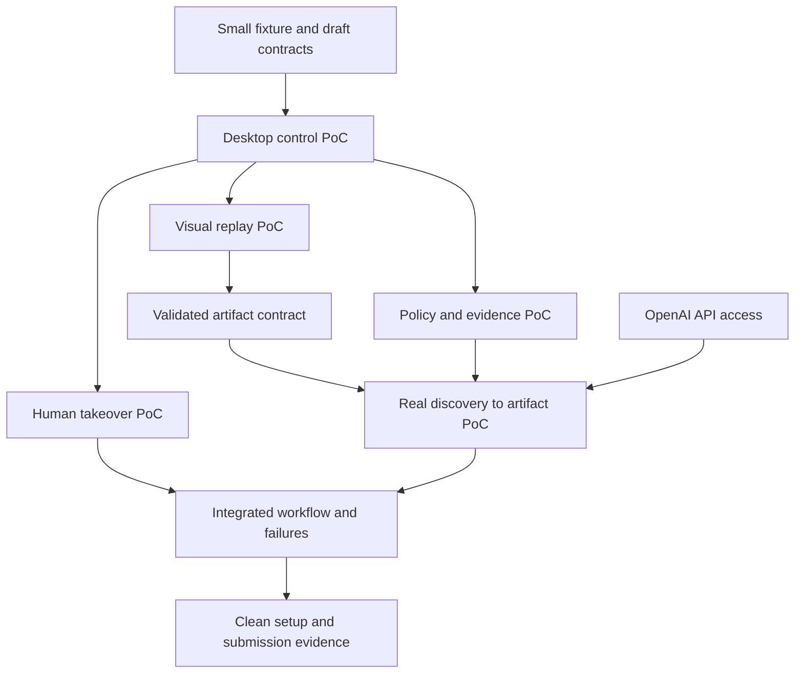

# Roadmap, proof-of-concept gates, and dependencies

Update 2026-09-15: **M2/PoC B passes its bounded acceptance gate.** Its [specification](MILESTONE_2.md) records options, primary-source research, selected boundaries, and implementation findings; [evidence](../evidence/poc-m2/README.md) retains failed/passing attempts and final hardening checks. M3 now implements PoC D with live simulated-operator checks; its [specification](MILESTONE_3.md) distinguishes automated validation from the real-person demonstration. OpenAI discovery (PoC E) remains pending and needs reviewed outbound observations plus artifact promotion. M2 was committed and pushed as `3726347`.

The first bounded implementation slice is specified in [MILESTONE_1.md](MILESTONE_1.md), covering the minimal fixture, desktop control, and model-free visual replay. Later roadmap requirements remain in scope for subsequent milestones.

M1 completion record, 2026-09-12: **M1 is complete**, including PoC C's repeated/reproducibility gate. The corrected full run passed 47 tests, ten alternating-member baselines, seven scenarios, and seven rejection cases; both the initial failed attempt and successful rerun are retained in [M1-06 evidence](../evidence/poc-m1/acceptance/README.md). PoC A is proven for the tested desktop. PoC B, D, and E were pending at M1 completion; the M2 update above records subsequent progress. M1-04 was pushed as `1d89ba8`; M1-05 (`2ea242a`) and M1-06 are committed and pushed at the user's request.

## Objective and order of work

Deliver one complete capability: a real OpenAI-driven desktop discovery run finds a synthetic member's savings balance, produces a reviewed and validated reusable artifact, and replays for another member without a model. Demonstrate explicit runtime outcomes, policy enforcement, evidence, and a real human takeover of the same desktop session.

The highest-risk assumption is reliable model-free visual replay. Prove it before investing in a polished agent, UI, or general artifact language. Treat human input capture and policy enforcement as early feasibility questions too.

Build order differs from final demonstration order. A hand-authored artifact may exercise the interpreter in an early PoC; the final artifact must come from an actual successful discovery run, with any review or annotations documented. An early manual artifact is never represented as discovery evidence.

## Initial choices

- Python automation engine, Pydantic contracts, JSON capability files and JSONL run events.
- OpenAI Responses API; start with GPT-5.6 Sol structured computer actions and one provider key.
- PyAutoGUI desktop input; OpenCV visual matching and Tesseract OCR as initial local recognition candidates.
- Tiny React/TypeScript banking fixture with synthetic data and controllable exceptional states.
- One isolated desktop and one display. Try a local Linux desktop with a viewer first; choose VM/container packaging based on the environment PoC. Do not claim cross-OS portability from one tested environment.
- One automation coordinator, no distributed workers or capability database.

## Dependency map

Human takeover, visual replay, and policy work can progress independently after the desktop is available. These are independent workstreams, not a requirement to use multiple agents or build services.

## Phase 0: Establish a small testable contract

Define the first workflow and its supported conditions: search member, open the matching member, select savings, verify identity, and return amount in minor units plus currency. Use string member IDs. Fix an initial locale, display scale, and desktop configuration.

Specify a minimal action vocabulary, a provisional target/checkpoint representation, output/result types, and ownership states. Keep the artifact schema provisional until targeting has been exercised. Declare action limits and known business outcomes before writing the loop.

Prepare only enough fixture screens to test those operations. Include two distinct successful members, one missing member, and controlled loading/session/error behavior. Fixture reset and truth belong to the test harness and must not be exposed to discovery or replay as a business-task shortcut.

Deliverable: a small fixture specification, draft contract, and acceptance matrix. No React design system, real authentication, real bank integration, or persistent banking backend is necessary.

## Phase 1: Establish the desktop and execution boundary

### PoC A: Can we operate and observe the same isolated desktop?

Prove screenshot capture, click, type, keyboard navigation, scrolling, and live manual viewing. Check that the screenshot coordinate system agrees with input coordinates. Establish known display scaling, application focus, and reset behavior.

**Pass:** the controller can complete a short input sequence on a visible fixture screen, verify the result, reset the environment, and repeat it without touching the user's personal desktop. The human viewer shows the exact same session. A stop mechanism prevents further automated input.

**Blocks:** visual replay, real discovery, and meaningful handoff testing. It does not block writing contracts or a small fixture.

**If it fails:** change desktop packaging or input backend. Do not build around mismatched coordinates or quietly replace the desktop runtime with DOM automation.

### PoC B: Can we enforce policy and export safe evidence?

Implementation: [M2](MILESTONE_2.md), including policy checks at input dispatch, reviewed-artifact admission, an isolated fixture gateway, Chromium restrictions, and an exporter that suppresses images and business values. The initial export is metadata-only; general redaction and arbitrary-application authorization are not claimed.

Prototype a narrow execution gate with allowed applications, permitted operations, and network destinations. Enforce what can be enforced outside the model. For a browser-hosted fixture, determine whether the chosen environment needs route-specific instrumentation; network/domain restriction alone is not a route allowlist.

Exercise a forbidden destination, an unapproved application/focus change, and a risky operation. Check policy immediately before input execution. A declared action type such as click does not establish that clicking any visible control is safe; screen and operation context matter.

Send synthetic sensitive sentinel values through logs and screenshot capture. Demonstrate sanitized export and suppression of unsafe captures. Default screenshot handling must not persist secrets before redaction. Redacting an anchor must not destroy the information required to match it: choose non-sensitive anchors or reject the artifact.

**Pass:** the selected forbidden cases are blocked or safely stopped with a structured reason; exported evidence contains no sentinel values. Document remaining limits. Treat page text that asks for a policy violation as untrusted content.

**Blocks:** any model-driven run that can act freely, retention of live-run evidence, and the final safety claim.

**If it fails:** constrain the supported environment and operation vocabulary, add enforcement at the desktop/network boundary, or explicitly stop unsupported operations. A prompt-only policy is not sufficient.

## Phase 2: Prove the two difficult runtime mechanisms

### PoC C: Can replay find targets and return correct data without an LLM?

Start with a minimal manually prepared target description to isolate recognition from model behavior. Locate a visual anchor, identify the intended control, enter an input, wait for a visual checkpoint, and extract/validate a changing balance with local OCR.

Use two members with different balances and an identity check. Test a modest window/element translation within the declared supported conditions, delayed rendering, repeated labels, an ambiguous target, and a missing checkpoint. Keep display-scale changes outside the initial contract unless explicitly tested.

**Proposed gate:** ten fresh/reset baseline replays across the two members return exact expected outputs; the supported translation and delayed-rendering cases work; ambiguous or unreadable cases stop correctly. This is a small feasibility gate, not a production reliability estimate.

Run without model credentials and block access to model endpoints. No LLM may locate controls, read the balance, or judge completion during replay.

**Blocks:** final target/extraction schema, trustworthy artifact promotion, and the discovery-to-replay demonstration. The model can be explored earlier, but polishing its loop before this passes risks proving the wrong thing.

**If it fails:** inspect anchor design and OCR normalization; use accessibility data where actually available; narrow and document supported rendering conditions. If the proposed approach still cannot establish identity and output accurately, revise it before expansion. Never hide recognition failure behind an LLM call during ordinary replay.

### PoC D: Can a human take over, be recorded, and return control safely?

Trigger a benign blocked state such as a synthetic session-expiry screen. Quiesce automation, transfer input ownership, allow manual steps in the same desktop, capture non-sensitive human action metadata, and resume from a verified checkpoint.

Test a late model response, an in-flight input sequence, a premature resume request, and a human returning on the wrong screen. The input path must reject stale actions after ownership changes. A screenshot viewer alone does not provide the required control-transfer or action-capture mechanism.

**Pass:** the session is unchanged, automation issues no input during human control, human actions have an audit record without sensitive keystrokes, and an invalid resume state cannot continue silently. A valid return can complete the workflow.

**Blocks:** the escalation requirement and integrated completion. It does not block recognition experiments or drafting the artifact.

**If it fails:** change the viewer/input-capture arrangement or introduce a minimal controlled input gateway. Do not defer the real handoff mechanism to a final UI phase.

## Phase 3: Connect genuine discovery to the replay contract

### PoC E: Can a successful model run become a reusable capability?

Supply a natural-language goal, target entry point, and explicit typed input bindings. Send desktop screenshots to OpenAI and execute its structured actions through the already checked executor. Apply step, elapsed-time, repeated-action, and spending caps. The prompt must not contain a prewritten click sequence.

Record executed actions with before/after observations. Convert targets into the visual/accessibility descriptions established in Phase 2. Parameterize member-specific values; propose output regions and success checks; validate the candidate artifact and document any human review/annotations. Keep exception rules' provenance separate from what the successful run actually observed.

**Pass:** one real discovery reaches the independently verified result, emits an artifact, and that artifact replays successfully for the second member without model access. No hidden manual rewrite of a specific test path is presented as automatic discovery.

**Blocks:** the assignment's central demonstration and authentic discovery evidence.

**If it fails:** classify whether the failure is model observation/action choice, coordinate binding, recorder generalization, or artifact validation. Repair the specific boundary. A stronger OpenAI model is an option if the issue is reasoning; it does not repair an invalid recorder or replay contract.

After this passes, stabilize the first artifact version. Preserve separate schema and capability versions. Avoid a general workflow language with unrestricted loops or executable expressions.

## Phase 4: Integrate every core requirement

Connect the proven components into one coherent run lifecycle. Every component uses the same policy checks, session ownership, typed outcomes, and sanitized event format.

Complete the scenario matrix:

| Scenario | Required behavior |
| --- | --- |
| Successful discovery | Genuine model-driven UI run with evidence |
| Replay for a different member | Correct identity, exact typed output, zero model calls |
| Invalid input | Rejected before UI mutation |
| Missing member | Named business outcome |
| Slow load | Bounded wait/recovery or clear timeout |
| Known benign dialog | Explicit deterministic handling |
| Permission denial | Clear stop without bypass |
| Unknown dialog/ambiguous target | Stop or intervention with context |
| Session expiry | Real human takeover and verified resumption |
| Risky operation | Blocked before execution under initial policy |
| Uncertain action outcome | No unsafe blind retry |
| Wrong screen after handoff | Resume rejected or redirected only by declared rules |
| Sensitive sentinel | Absent from persisted/exported evidence |

When no reliable observation proves that a risky action is safe, stop. A prototype must not claim to solve general screenshot-based action authorization.

The operator UI only needs to expose intervention context and takeover/resume controls. React polish, browsing historical runs, and capability catalogs remain deferred.

**Exit:** every core requirement is demonstrated by at least one test or real run, and no module bypasses the central executor or ownership rules.

## Phase 5: Make the submission reproducible and reviewable

Rehearse from a clean clone/environment with documented configuration. Verify replay works without an OpenAI key. Pin dependencies and local recognition assets; document display and OS assumptions.

Save a genuine artifact plus sanitized discovery, replay, exceptional-state, and human-handoff evidence. Write exact setup/demo commands in README and the approximately 1–3 page REPORT using the assignment's seven required headings. Record cuts, unsupported environments, and manual review steps honestly.

Review persisted files for sensitive values. Evidence gathering happens throughout development; this phase packages and checks it. No requirement is satisfied by a fabricated or merely simulated discovery trace.

**Exit:** a reviewer can reproduce the claimed demo, understand the artifact, inspect a failure, and see the real handoff. Public visibility and any push/submission still require the user's explicit request.

## Optional extension after all gates pass

Choose at most one or two: a broader repeated-run stability report; a second banking-app variant reusing the capability with reviewed overrides; or a tiny native-app demonstration using the same executor. Native controls being reusable does not mean the banking artifact works unchanged on unrelated software.

Do not build production orchestration, multiple model providers, multiple operating systems, or a rich operator dashboard before the core is complete.

## What is actually blocking what today?

The native/browser desktop input gate passed. Initial focus, viewer-port, Chromium sandbox, and process-readiness issues were corrected and documented. The remaining prerequisites are:

| Prerequisite | First dependent work | Can other work proceed? |
| --- | --- | --- |
| Further implementation scope | M3 was requested and implemented; PoC E and integration remain | Plans and dependency definitions are ready |
| Local desktop runtime/viewer — native/browser gate passed | Visual recognition and handoff | Fixture, oracle, and adapter are ready |
| OpenAI API access | Genuine discovery | All model-free PoCs can proceed |
| Minimal fixture/reset data — implemented in M1-02 | Meaningful desktop replay and error scenarios | Native smoke remains available |
| Visual recognition and repeated manual replay — gate passed | Discovery-generated artifact validation | Handoff and policy can proceed |
| Bounded policy/evidence gate — passed in M2 | Controlled model execution still needs reviewed outbound observations | Handoff design can proceed |
| Same-session handoff mechanism — M3 implemented; real-person demonstration pending | Integrated escalation acceptance | Core discovery/replay can proceed |

M1 and bounded M2/PoC B are complete; M3 implements the same-session handoff mechanism and its automated checks. A real-person demonstration remains an explicit submission requirement. Next is genuine discovery: verify OpenAI API access, review outbound observations, bind pending model actions to ownership epochs, and promote a genuinely generated artifact. Discovery has not been implemented.
